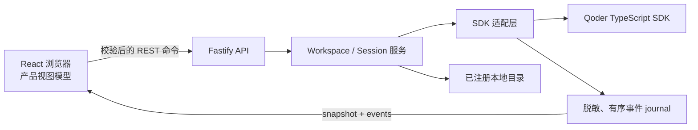

# Qoder Agent SDK Web UI Showcase

这是一个使用 Qoder TypeScript Agent SDK 构建的完整本地 Web 应用样板。它不是最小 API 包装，也不是 SDK 自带 UI；它展示如何把长生命周期 `Query`、Session、流式消息、Approval、MCP、Hooks、Task、Checkpoint、错误、恢复和退出组合成可维护的 Fastify + React 产品。

浏览器使用中文浅色产品界面。Session、Workspace、Model、Permission、MCP、Hook、Task、Checkpoint、Skill、Command、Tool 等 SDK 概念保留英文名称，方便对照 SDK 类型和源码。

## 运行时选择

| 命令 | 会使用什么 | 是否可能发起真实外部调用 | 适用场景 |
| --- | --- | --- | --- |
| `npm run dev` | 真实 SDK 适配层和当前认证 | 会；创建 Session 或发送消息时会调用真实 SDK | 本地开发、人工试用 |
| `npm run build && npm start` | 真实生产构建和当前认证 | 会；浏览器操作 Session 时会调用真实 SDK | 生产形态试用 |
| `npm run check` | 真实类型/构建与生产服务器 smoke，加上注入 fake/fixture 的单元、集成和浏览器验收 | 不会创建真实 SDK Session，也不应发起真实模型调用 | 默认回归门禁 |
| `npm run test:smoke:real` | 已安装的真实 SDK、CLI/Token 认证和隔离临时 Session | **会** | 明确授权后的真实链路验证 |

`npm run dev` 或 `npm start` 启动本身不等于已经调用模型；真正创建、恢复 Session 或发送消息后才会进入 SDK 链路。`npm run test:smoke:real` 是显式 opt-in 命令，输出 `SKIP` 只表示认证条件不足，不代表真实验证通过。

## 学习路线

- **5 分钟：先跑通一个 Query。** 阅读 [SDK 快速开始](docs/SDK_QUICK_START.md#单次-query)，复制单次 Query 示例，理解 `query()`、auth、`cwd`、异步消息流和 `close()`。
- **15 分钟：理解 Web UI 的核心接线。** 继续阅读 [长生命周期交互示例](docs/SDK_QUICK_START.md#长生命周期交互-query) 和 [一条消息如何穿过系统](docs/SDK_CODE_TOUR.md#一条消息如何穿过系统)，再对照 `query-factory.ts`、`input-queue.ts` 和 `session-controller.ts`。
- **30 分钟：验证完整产品。** 按 [产品试用手册的 30 分钟组合](docs/PRODUCT_TRIAL_GUIDE.md#试用路线) 操作 Session、流式消息、Approval、MCP、Subagent、运行时控制和 Checkpoint，并记录证据边界。

## 文档导航

| 文档 | 适合谁 | 解决什么问题 | 完成标志 |
| --- | --- | --- | --- |
| 当前 README | 第一次进入项目的开发者 | 如何选择运行方式、安装、启动和定位文档 | 能安全启动正确的运行时 |
| [SDK 快速开始](docs/SDK_QUICK_START.md) | 第一次使用 Qoder TypeScript Agent SDK 的开发者 | 可复制的单次与长生命周期 Query | 示例通过类型检查，理解 Query 生命周期 |
| [SDK 代码导览](docs/SDK_CODE_TOUR.md) | 准备复用本样板架构的开发者 | SDK 调用如何映射到服务端、事件和浏览器 | 能从产品能力定位到 SDK 符号、源码和测试 |
| [产品试用手册](docs/PRODUCT_TRIAL_GUIDE.md) | 产品、设计、测试和集成开发者 | 如何操作界面并判断能力是否真的被验证 | 每个案例都有证据级别、确定性和副作用记录 |
| [SDK 适配层维护说明](src/server/sdk/README.md) | 修改 `src/server/sdk/` 的维护者 | 每个适配文件的职责和依赖方向 | 能在不扩大 SDK 边界的前提下修改适配器 |

## 快速运行

### 环境要求

- Node.js 22 或更高版本。
- 运行 Playwright 验收时需要 Chromium。
- 人工试用真实 SDK 时，需要已有的 `qodercli` 登录或 Qoder personal access token。

从 `typescript/` workspace 安装依赖：

```bash
cd typescript
npm install
npx playwright install chromium
cd web-ui-showcase
cp .env.example .env
```

### 认证

默认 `QODER_WEBUI_AUTH=cli`，服务端调用 `qodercliAuth()` 复用本机登录。使用 access token 时，在环境或未提交的 `.env` 中设置：

```dotenv
QODER_WEBUI_AUTH=access-token
QODER_PERSONAL_ACCESS_TOKEN=your-token
```

凭证只由服务端读取。不要把 token 放进 React 环境变量、浏览器请求、localStorage、截图或提交到仓库。

### 开发模式

```bash
npm run dev
```

Fastify 默认监听 `127.0.0.1:8787`，Vite 默认监听 `127.0.0.1:5173`。打开 [http://127.0.0.1:5173](http://127.0.0.1:5173)。

### 生产构建

```bash
npm run build
```

```bash
QODER_WEBUI_HOST=127.0.0.1 QODER_WEBUI_PORT=8787 npm start
```

打开 [http://127.0.0.1:8787](http://127.0.0.1:8787)。

## 产品行为摘要

- **首次发送与 Workspace：** 可以先输入再选择 Workspace。首次 Send 会打开原生目录选择器，保留草稿，注册规范化目录，创建 Session，并提交同一条消息。
- **Session：** 每个 Session 永久绑定一个 Workspace。选择 Session 会加载投影历史并使对应 SDK Query 可用；并发可用性请求会合并。
- **语义转录：** Assistant 增量与最终消息合并为同一语义项；Tool 输入、状态和结果按 tool-use id 合并；Subagent 内部消息留在独立详情中；SDK 控制回执不会变成普通聊天卡片。
- **交互：** Approval、`AskUserQuestion` 和 MCP elicitation 在对话内完成。命令失败归属发起它的控件，只有连接或实时协议错误使用全局提示。
- **Composer：** `/model`、`/permissions` 和 `/context` 控制当前 Session；`/mcp` 打开 SDK Console 的 MCP 页签；`@ Files` 只搜索已注册目录中的路径，不读取文件正文。
- **异步输入：** 应用保留 SDK 的 `priority` 与 `shouldQuery`，产品 Composer 默认使用 `next` 和 `true`。`delivered` 只表示消息已交给 SDK 输入 transport，不表示 turn 已完成。
- **MCP 与 Hooks：** MCP 状态、Hooks、Raw Events、Skills、Agents、Plugins 和 Account 位于默认关闭的 SDK Console；MCP elicitation 仍显示在对话内。
- **Checkpoint：** 符合条件的用户消息提供 Checkpoint 操作。用户先选择 files、conversation 或 both，执行 dry-run，检查影响摘要，再确认执行。
- **Task：** SDK Task 消息会被投影，服务端和 API Client 也适配了 `backgroundTasks()` / `stopTask()`；当前产品没有可达的 Task 列表或控制按钮，不能把自然语言启动/停止 Task 当成 UI 已直接调用这两个方法的证据。

完整操作步骤见[产品试用手册](docs/PRODUCT_TRIAL_GUIDE.md)。

## 架构与边界



浏览器不依赖 SDK：

- [`src/shared/`](src/shared/) 定义经过 Zod 校验的 command、snapshot、event 和浏览器安全 view model。
- [`src/client/transport/`](src/client/transport/) 负责命令与有序实时恢复；[`src/client/store/`](src/client/store/) 把 snapshot/event 规约成产品状态。
- 只有 [`src/server/sdk/`](src/server/sdk/) 可以 import `@qoder-ai/qoder-agent-sdk`。
- [`src/server/services/`](src/server/services/) 只依赖应用 port 并负责产品策略；[`src/server/api/`](src/server/api/) 负责校验和委派。

`npm run check:boundary` 会执行 [`scripts/check-sdk-import-boundary.mjs`](scripts/check-sdk-import-boundary.mjs) 以强制这条依赖方向。

### 复用时区分四层

1. **SDK 必需合同：** `query()`、`Query` 异步迭代、`SDKUserMessage`、Session state、交互回调、公开 Session catalog 与 rewind 接口。
2. **Showcase 策略：** 窄 `QueryPort`、Composer 默认值、能力门禁、command ownership，以及 Checkpoint 必须 idle、当前且单次使用。
3. **产品基础设施：** Workspace 规范化、父级 Session 先于子事件、snapshot/replay 一致性、mutation fence、浏览器脱敏和受限文件发现。
4. **可选诊断：** SDK Console 的 Hooks/Raw Events 与真实账号 smoke。它们帮助教学和排障，但不是 SDK 强制 UI。

更详细的端到端映射见 [SDK 代码导览](docs/SDK_CODE_TOUR.md)。

## Workspace 与本地安全

[`workspace-service.ts`](src/server/services/workspace-service.ts) 只注册原生选择器或显式本地路径产生的规范化目录。浏览器创建 Session 时发送 Workspace id，而不是任意 `cwd`；已有 Session 不能静默切换根目录。

[`workspace-file-service.ts`](src/server/services/workspace-file-service.ts) 优先搜索 Workspace，再搜索明确允许的目录。所有 root 共用扫描预算；服务端重新检查 real path，跳过 symlink 和生成目录，并只返回路径。浏览器对请求做 200 ms debounce，过时请求或断开的 HTTP client 会取消扫描。最终 Tool 权限仍由 SDK runtime 和 Permission Mode 决定。

服务只允许 `127.0.0.1`、`::1` 或 `localhost`，REST 与 WebSocket 使用同一精确 Origin allowlist，并启用 CSP、Zod 校验及浏览器投影脱敏。这是单用户本地样板，不是已经加固的托管服务。不要直接通过反向代理暴露端口；托管前必须补充应用级认证、授权和租户隔离。

## MCP 配置

每个 Session 都包含只读的进程内 `showcase_project` MCP Server。额外的服务端 MCP 配置可以通过 `QODER_WEBUI_MCP_CONFIG_FILE` 加载：

```json
{
  "docs": {
    "type": "http",
    "url": "http://127.0.0.1:9000/mcp",
    "tools": [{ "name": "search", "permission_policy": "always_ask" }]
  }
}
```

只加载可信配置。远程 headers、子进程环境和 OAuth token 留在服务端；需要用户操作时，服务端只向浏览器发布经过协议校验的授权 URL 和脱敏、限量的状态。用户粘贴的 callback URL 会通过一次受校验请求提交给服务端，成功后从组件本地输入中清除，不写入 snapshot、realtime event 或诊断记录。

## 验证

默认门禁不需要 Qoder 账号，也不应发起真实模型调用：

```bash
npm run check
```

它依次执行 TypeScript 检查、SDK import 边界、单元测试、集成测试、生产构建、生产 HTTP/WebSocket smoke 和 Playwright。Playwright 阶段使用的 [`test/e2e/fixture-server.ts`](test/e2e/fixture-server.ts) 替换外部 Query、Workspace repository、原生目录选择器和 Session catalog，但保留真实浏览器、Fastify 路由、应用服务、Session controller、语义投影、journal 与实时恢复；生产 smoke 则启动实际构建产物，但不创建 Session 或调用模型。

迭代时可以运行：

```bash
npm run typecheck
npm run check:boundary
npm run test:unit
npm run test:integration
npm run build
npm run test:smoke:production
npm run test:e2e
```

明确要使用真实账号验证时才运行：

```bash
npm run test:smoke:real
```

真实 smoke 会创建隔离临时 Workspace 和 Session，完成一个模型 turn，验证 SDK 历史，恢复 Session，然后只删除该临时 Session 和目录。初始化、首个成功 result、恢复、关闭和清理均有截止时间；失败后仍分别尝试关闭 Query、删除 Session 记录和移除临时目录。

## 扩展样板

新增浏览器可见能力时：先定义 shared command/event/view model，再实现服务端 SDK adapter 和应用策略，随后将 event 规约到 client state，并把交互放到自然的产品入口。SDK 对象与凭据必须留在服务端；accepted command 使用 `commandId` 关联异步失败；最后增加能证明组装后事件顺序的确定性测试，并在 [SDK 代码导览的能力地图](docs/SDK_CODE_TOUR.md#能力地图) 中登记。
