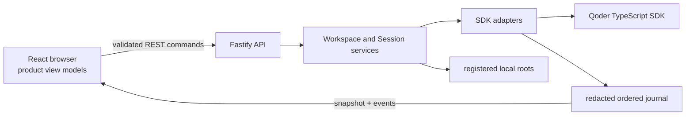

# Qoder Agent SDK Web UI Showcase

This sample is a complete local Web UI application built with the Qoder TypeScript SDK. It is intended as an open-source application template: the product UI stays focused on project work, while the source demonstrates how Session, streaming messages, Approval, MCP, Hooks, Task, Credits, errors, Checkpoint, shutdown, and recovery fit together.

The browser uses a Chinese, light-theme product shell. Established SDK concepts such as Session, Workspace, Model, Permission, MCP, Hooks, Task, Checkpoint, Credits, Skill, Command, and Tool retain their English names. Model and Permission Mode are compact Composer selectors, MCP remains in Settings and `/mcp`, and Tool input/result expands beneath its transcript row.

## Run the sample

Requirements:

- Node.js 22 or later.
- A Chromium browser for Playwright acceptance tests.
- Either an existing `qodercli` login or a Qoder personal access token.

Install all TypeScript sample dependencies from the parent directory:

```bash
cd typescript
npm install
npx playwright install chromium
cd web-ui-showcase
cp .env.example .env
```

Development mode starts Fastify on `127.0.0.1:8787` and Vite on `127.0.0.1:5173`:

```bash
npm run dev
```

Open [http://127.0.0.1:5173](http://127.0.0.1:5173).

Build and run the production server:

```bash
npm run build
QODER_WEBUI_HOST=127.0.0.1 QODER_WEBUI_PORT=8787 npm start
```

Open [http://127.0.0.1:8787](http://127.0.0.1:8787).

Authentication defaults to `QODER_WEBUI_AUTH=cli`, which calls `qodercliAuth()`. To use an access token, set `QODER_WEBUI_AUTH=access-token` and provide `QODER_PERSONAL_ACCESS_TOKEN` in the environment or an uncommitted `.env`. Credentials are never accepted by the browser UI or included in browser view models.

## Product behavior

The home screen contains one Composer. A user may type before choosing a Workspace. If the first Send has no Workspace, the server opens the native directory picker, preserves the draft, registers the canonical directory, creates the Session, and submits that same first message as one operation.

Each Session is permanently associated with its Workspace root. Selecting a Session immediately selects its projected transcript and asks the server to make its SDK Query available. Concurrent availability requests are deduplicated. A specific failure appears in the conversation; selecting the Session again starts a fresh attempt. SDK controller phases are not product controls.

The conversation is a semantic projection rather than a card for every SDK event:

- text deltas and the final Assistant message update one Assistant item;
- Tool input, lifecycle, result, and timing update one Tool row by tool-use identifier;
- clicking an ordinary Tool expands its input and result beneath the same row;
- an `Agent` Tool opens contextual Subagent Details; its instruction, Assistant messages, and internal Tools stay out of the main transcript and retain their own event order;
- Assistant text is split at Tool boundaries so live and restored transcripts retain SDK event order;
- SDK control receipts and standalone Task summaries stay out of the product transcript;
- Approval, `AskUserQuestion`, and MCP elicitation remain actionable inline;
- turn errors stay with the affected turn and command failures stay with their control;
- only a realtime protocol or connection failure uses the global banner.

The Composer owns Session-scoped drafts. Enter sends ordinary input, Shift+Enter inserts a newline, and Enter or Tab completes an open suggestion. Arrow keys keep the active option visible. Newline-delimited SDK prompt Suggestions are normalized into separate actions; selecting one fills the draft without sending it. `/model` and `/permissions` focus their inline selectors; `/mcp` opens MCP settings. SDK Commands and Skills use the SDK input path. `@ Files` searches the Session Workspace and explicitly allowed directories without reading file content into suggestions. Only commands with an implemented execution strategy are advertised.

The document is fixed to the viewport. The Session list, transcript, contextual details, dialogs, and suggestion lists are the intentional scroll regions. The Session header and Composer remain visible while transcript history scrolls. Desktop side panels are resizable within guarded ranges; narrow layouts use overlay panels and preserve keyboard focus.

## Architecture



The browser is SDK-agnostic. [`src/shared/`](src/shared) defines validated commands, snapshots, events, and browser-safe view models. [`src/client/transport/`](src/client/transport) sends commands and recovers ordered realtime delivery. [`src/client/store/`](src/client/store) reduces snapshots and idempotent events into normalized product state.

Only [`src/server/sdk/`](src/server/sdk) may import `@qoder-ai/qoder-agent-sdk`. [`src/server/services/`](src/server/services) owns application policy without importing SDK types, and [`src/server/api/`](src/server/api) validates one request before delegating one operation. Run `npm run check:boundary` to enforce that dependency direction.

| Capability | Primary implementation | Product placement |
| --- | --- | --- |
| Session creation and automatic availability | [`session-start-service.ts`](src/server/services/session-start-service.ts), [`session-registry.ts`](src/server/sdk/session-registry.ts) | Hero and Session sidebar |
| Message queue and semantic stream | [`input-queue.ts`](src/server/sdk/input-queue.ts), [`message-projector.ts`](src/server/sdk/message-projector.ts) | Composer and conversation |
| Subagent history | public SDK `listSubagents` and `getSubagentMessages` through [`session-catalog.ts`](src/server/sdk/session-catalog.ts), correlated by [`subagent-transcript-service.ts`](src/server/services/subagent-transcript-service.ts) | `Agent` Tool and contextual Details |
| Approval and questions | [`interaction-broker.ts`](src/server/sdk/interaction-broker.ts), [`interaction-card.tsx`](src/client/features/interactions/interaction-card.tsx) | Inline conversation |
| MCP | [`mcp-service.ts`](src/server/sdk/mcp-service.ts), [`mcp-panel.tsx`](src/client/features/mcp/mcp-panel.tsx) | Inline elicitation and MCP settings |
| Hooks | [`hooks.ts`](src/server/sdk/hooks.ts) | SDK Console |
| Task | [`runtime-capability-service.ts`](src/server/sdk/runtime-capability-service.ts), [`runtime-routes.ts`](src/server/api/runtime-routes.ts) | SDK lifecycle state and command API without a standalone transcript card |
| Credits and Account | [`runtime-capability-service.ts`](src/server/sdk/runtime-capability-service.ts) | Account settings |
| Checkpoint | [`checkpoint-service.ts`](src/server/sdk/checkpoint-service.ts), [`api-client.ts`](src/client/transport/api-client.ts) | SDK adapter and API example; intentionally omitted from the product transcript |
| Errors | [`error-handler.ts`](src/server/api/error-handler.ts), [`message-projector.ts`](src/server/sdk/message-projector.ts) | Owning turn/control or global transport banner |
| Recovery and exit | [`realtime-hub.ts`](src/server/realtime/realtime-hub.ts), [`shutdown.ts`](src/server/shutdown.ts) | Automatic snapshot recovery and server lifecycle |

Hooks and Raw Events are diagnostic rather than ordinary product interactions. They live only in the default-closed SDK Console. Entries are redacted before projection and bounded by depth, node count, serialized byte size, and journal capacity. Set `QODER_WEBUI_RAW_EVENTS=false` to omit Raw Events while retaining semantic conversation, Hook, Task, Credits, and error projections.

Child-agent SDK messages carry `parent_tool_use_id`. The semantic projector keeps those records out of the main conversation while Raw Events may still observe their redacted diagnostics. Selecting the parent `Agent` Tool asks the server to associate that opaque Tool id with public SDK Subagent history, then returns only the strict projected transcript. The browser never reads SDK transcript files or fans out across agent ids.

## Workspace and local-path safety

[`workspace-service.ts`](src/server/services/workspace-service.ts) registers canonical directories selected through the native picker or an explicit local path. Session creation accepts a Workspace identifier, not an arbitrary browser-provided working directory. Existing Sessions cannot silently change roots.

[`workspace-file-service.ts`](src/server/services/workspace-file-service.ts) searches only the canonical Workspace and server-registered allowed directories. It rechecks real paths, skips symlinks and generated directories, limits traversal depth and entry count, and returns paths rather than content. Final tool access and Approval remain the responsibility of the SDK runtime and selected Permission mode.

The server binds only to `127.0.0.1`, `::1`, or `localhost`, applies the same exact Origin allowlist to REST and WebSocket requests, applies a CSP, validates JSON with Zod, and redacts credential-shaped fields. Requests without an Origin remain available to local CLI and test clients. This is a single-user local template, not a hardened hosted service. Do not expose its port through a reverse proxy or load untrusted MCP configuration without adding application-specific authentication and authorization.

## MCP and extension configuration

Every Session includes the read-only in-process `showcase_project` MCP server. Additional server-only MCP configuration may be loaded from `QODER_WEBUI_MCP_CONFIG_FILE`:

```json
{
  "docs": {
    "type": "http",
    "url": "http://127.0.0.1:9000/mcp",
    "tools": [{ "name": "search", "permission_policy": "always_ask" }]
  }
}
```

Remote headers, subprocess environments, OAuth state, and callback processing stay on the server. The browser receives only the bounded status required by product controls.

## Deterministic and real-SDK verification

The default gate requires no Qoder account:

```bash
npm run check
```

It runs all TypeScript programs, the SDK import boundary, unit tests, integration tests, the production build, a production HTTP/WebSocket smoke, and Playwright. [`test/e2e/fixture-server.ts`](test/e2e/fixture-server.ts) replaces the external Query, Workspace repository, native directory picker, and Session catalog with deterministic test adapters. The fixture still exercises the real browser, Fastify routes, application services, Session controller, semantic projection, event journal, and realtime recovery. Every Playwright journey explicitly clears prior fixture state and creates its own Workspace, Session, and turns.

Individual commands are available when iterating:

```bash
npm run typecheck
npm run check:boundary
npm run test:unit
npm run test:integration
npm run build
npm run test:smoke:production
npm run test:e2e
```

The opt-in smoke uses the installed Qoder TypeScript SDK and a real account:

```bash
npm run test:smoke:real
```

It creates an isolated temporary Workspace and Session, completes one model turn, verifies SDK history, resumes the Session, deletes only that temporary Session, and removes the temporary directory. Without usable authentication it prints `SKIP`; a skip is not a passing real-account result.

## Extending the template

Add a browser-visible capability in four steps: define its shared command/event view model, implement the server adapter, reduce the event into normalized client state, and place the interaction in its normal product surface. Keep SDK objects and credentials server-side, correlate accepted commands by `commandId`, and add a deterministic journey that proves the assembled event order.
