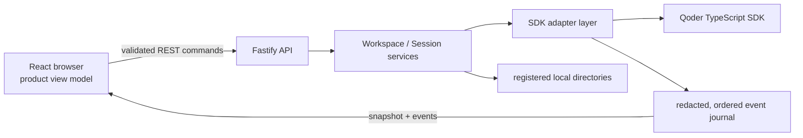

# Qoder Agent SDK Web UI Showcase

This is a complete local Web application example built with the Qoder TypeScript Agent SDK. It is neither a minimal API wrapper nor an SDK-provided UI. It demonstrates how to combine a long-lived `Query`, sessions, streaming messages, approvals, MCP, hooks, tasks, checkpoints, errors, recovery, and shutdown into a maintainable Fastify + React product.

The browser uses a Chinese-language light UI. SDK concepts such as Session, Workspace, Model, Permission, MCP, Hook, Task, Checkpoint, Skill, Command, and Tool remain in English so they are easy to match with SDK types and source code.

## Runtime Selection

| Command | What it uses | Can it make real external calls? | Best for |
| --- | --- | --- | --- |
| `npm run dev` | The real SDK adapter and current authentication | Yes; creating a session or sending a message calls the real SDK | Local development and manual trials |
| `npm run build && npm start` | The real production build and current authentication | Yes; browser session operations call the real SDK | Trying the production form |
| `npm run check` | Real type/build checks and production-server smoke tests, plus unit, integration, and browser acceptance tests with injected fakes/fixtures | No real SDK session is created, and no real model call should be made | Default regression gate |
| `npm run test:smoke:real` | The installed real SDK, CLI/token authentication, and an isolated temporary session | **Yes** | Explicitly authorized real-path verification |

Starting `npm run dev` or `npm start` does not itself call a model. The SDK path begins only after a session is created or resumed, or a message is sent. `npm run test:smoke:real` is explicitly opt-in. A `SKIP` result only means the authentication requirements were not met; it does not mean that real verification passed.

## Learning Path

- **5 minutes: run one Query.** Read [SDK Quick Start](docs/SDK_QUICK_START.md#single-query), copy the single-Query example, and understand `query()`, authentication, `cwd`, the asynchronous message stream, and `close()`.
- **15 minutes: understand the core Web UI wiring.** Continue with [Long-Lived Interactive Query](docs/SDK_QUICK_START.md#long-lived-interactive-query) and [How a Message Moves Through the System](docs/SDK_CODE_TOUR.md#how-a-message-moves-through-the-system), then compare them with `query-factory.ts`, `input-queue.ts`, and `session-controller.ts`.
- **30 minutes: verify the complete product.** Follow the [30-minute route in the Product Trial Guide](docs/PRODUCT_TRIAL_GUIDE.md#trial-routes) to exercise sessions, streaming messages, approvals, MCP, subagents, runtime controls, and checkpoints while recording the evidence boundary.

## Documentation Map

| Document | Audience | Question answered | Completion signal |
| --- | --- | --- | --- |
| This README | Developers opening the project for the first time | How do I select a runtime, install dependencies, start the app, and find the right documentation? | You can safely start the correct runtime |
| [SDK Quick Start](docs/SDK_QUICK_START.md) | Developers using the Qoder TypeScript Agent SDK for the first time | What are copyable examples for one-shot and long-lived queries? | The examples type-check and you understand the Query lifecycle |
| [SDK Code Tour](docs/SDK_CODE_TOUR.md) | Developers preparing to reuse this example's architecture | How do SDK calls map to the server, events, and browser? | You can trace a product capability to SDK symbols, source files, and tests |
| [Product Trial Guide](docs/PRODUCT_TRIAL_GUIDE.md) | Product, design, test, and integration developers | How do I operate the UI and decide whether a capability was actually verified? | Every case has an evidence level, determinism level, and side-effect record |
| [SDK Adapter Maintenance Guide](src/server/sdk/README.md) | Maintainers changing `src/server/sdk/` | What is each adapter file responsible for, and what is the dependency direction? | You can change an adapter without widening the SDK boundary |

## Quick Start

### Requirements

- Node.js 22 or later.
- Chromium when running Playwright acceptance tests.
- An existing `qodercli` login or Qoder personal access token when manually trying the real SDK.

Install dependencies from the `typescript/` workspace:

```bash
cd typescript
npm install
npx playwright install chromium
cd web-ui-showcase
cp .env.example .env
```

### Authentication

The default is `QODER_WEBUI_AUTH=cli`, which makes the server call `qodercliAuth()` to reuse the local login. To use an access token, set the following in the environment or an uncommitted `.env` file:

```dotenv
QODER_WEBUI_AUTH=access-token
QODER_PERSONAL_ACCESS_TOKEN=your-token
```

Credentials are read only by the server. Do not put a token in React environment variables, browser requests, localStorage, screenshots, or repository commits.

### Development Mode

```bash
npm run dev
```

Fastify listens on `127.0.0.1:8787` by default, and Vite listens on `127.0.0.1:5173`. Open [http://127.0.0.1:5173](http://127.0.0.1:5173).

### Production Build

```bash
npm run build
```

```bash
QODER_WEBUI_HOST=127.0.0.1 QODER_WEBUI_PORT=8787 npm start
```

Open [http://127.0.0.1:8787](http://127.0.0.1:8787).

## Product Behavior Summary

- **First send and Workspace:** You can type before selecting a Workspace. The first Send opens the native directory picker, preserves the draft, registers the canonical directory, creates a session, and submits the same message.
- **Session:** Each session is permanently bound to one Workspace. Selecting a session loads projected history and makes the corresponding SDK Query available; concurrent availability requests are coalesced.
- **Semantic transcript:** Assistant deltas and the final message merge into one semantic item. Tool input, status, and result merge by tool-use id. Subagent internals stay in separate details. SDK control acknowledgements do not become ordinary chat cards.
- **Interactions:** Approvals, `AskUserQuestion`, and MCP elicitation are completed inline. Command failures are owned by the control that initiated them; only connection or realtime protocol errors use global notices.
- **Composer:** `/model`, `/permissions`, and `/context` control the current session. `/mcp` opens the MCP tab in SDK Console. `@ Files` searches only paths in registered directories and does not read file contents.
- **Asynchronous input:** The application preserves the SDK's `priority` and `shouldQuery`; the product Composer defaults to `next` and `true`. `delivered` means only that the message reached the SDK input transport, not that the turn completed.
- **MCP and Hooks:** MCP status, Hooks, Raw Events, Skills, Agents, Plugins, and Account are in SDK Console, which is closed by default. MCP elicitation still appears inline.
- **Checkpoint:** Eligible user messages expose Checkpoint actions. The user selects files, conversation, or both; runs a dry run; reviews the impact summary; and then confirms execution.
- **Task:** SDK Task messages are projected, and the server and API client adapt `backgroundTasks()` / `stopTask()`. The current product has no reachable Task list or control button, so starting or stopping a Task through natural language is not evidence that the UI directly called these two methods.

See the [Product Trial Guide](docs/PRODUCT_TRIAL_GUIDE.md) for complete operating procedures.

## Architecture and Boundaries



The browser does not depend on the SDK:

- [`src/shared/`](src/shared/) defines Zod-validated commands, snapshots, events, and browser-safe view models.
- [`src/client/transport/`](src/client/transport/) handles commands and ordered realtime recovery; [`src/client/store/`](src/client/store/) reduces snapshots and events into product state.
- Only [`src/server/sdk/`](src/server/sdk/) may import `@qoder-ai/qoder-agent-sdk`.
- [`src/server/services/`](src/server/services/) depends only on application ports and owns product policy; [`src/server/api/`](src/server/api/) validates and delegates.

`npm run check:boundary` runs [`scripts/check-sdk-import-boundary.mjs`](scripts/check-sdk-import-boundary.mjs) to enforce this dependency direction.

### Four Layers to Distinguish When Reusing the Example

1. **SDK-required contracts:** `query()`, asynchronous iteration over `Query`, `SDKUserMessage`, session state, interaction callbacks, the public session catalog, and rewind APIs.
2. **Showcase policies:** the narrow `QueryPort`, Composer defaults, capability gates, command ownership, and the requirement that a Checkpoint be idle, current, and single-use.
3. **Product infrastructure:** Workspace canonicalization, parent sessions published before child events, snapshot/replay consistency, mutation fences, browser redaction, and constrained file discovery.
4. **Optional diagnostics:** Hooks/Raw Events in SDK Console and real-account smoke testing. They help teaching and troubleshooting but are not SDK-mandated UI.

See the [SDK Code Tour](docs/SDK_CODE_TOUR.md) for a more detailed end-to-end mapping.

## Workspace and Local Security

[`workspace-service.ts`](src/server/services/workspace-service.ts) registers only canonical directories produced by the native picker or an explicit local path. When creating a session, the browser sends a Workspace id instead of an arbitrary `cwd`; an existing session cannot silently switch its root directory.

[`workspace-file-service.ts`](src/server/services/workspace-file-service.ts) searches the Workspace first and then explicitly allowed directories. All roots share one scan budget. The server rechecks real paths, skips symlinks and generated directories, and returns paths only. The browser debounces requests by 200 ms and cancels scans for stale requests or disconnected HTTP clients. Final Tool permissions are still determined by the SDK runtime and Permission Mode.

The service accepts only `127.0.0.1`, `::1`, or `localhost`. REST and WebSocket use the same exact Origin allowlist, with CSP, Zod validation, and browser-projection redaction enabled. This is a single-user local example, not a hardened hosted service. Do not expose the port directly through a reverse proxy; add application authentication, authorization, and tenant isolation before hosting it.

## MCP Configuration

Each session includes a read-only in-process `showcase_project` MCP server. Additional server-side MCP configuration can be loaded through `QODER_WEBUI_MCP_CONFIG_FILE`:

```json
{
  "docs": {
    "type": "http",
    "url": "http://127.0.0.1:9000/mcp",
    "tools": [{ "name": "search", "permission_policy": "always_ask" }]
  }
}
```

Load only trusted configuration. Remote headers, subprocess environments, and OAuth tokens stay on the server. When user action is required, the server publishes only a protocol-validated authorization URL and redacted, bounded status to the browser. A pasted callback URL is submitted to the server in one validated request; after success it is cleared from component-local input and is not written to snapshots, realtime events, or diagnostics.

## Verification

The default gate does not require a Qoder account and should not make real model calls:

```bash
npm run check
```

It runs TypeScript checks, the SDK import boundary check, unit tests, integration tests, a production build, a production HTTP/WebSocket smoke test, and Playwright in sequence. The [`test/e2e/fixture-server.ts`](test/e2e/fixture-server.ts) used by Playwright replaces the external Query, Workspace repository, native directory picker, and session catalog while retaining the real browser, Fastify routes, application services, session controller, semantic projection, journal, and realtime recovery. The production smoke test starts the actual build artifact but does not create a session or call a model.

During iteration, run:

```bash
npm run typecheck
npm run check:boundary
npm run test:unit
npm run test:integration
npm run build
npm run test:smoke:production
npm run test:e2e
```

Run the real-account check only when real verification is explicitly intended:

```bash
npm run test:smoke:real
```

The real smoke test creates an isolated temporary Workspace and session, completes one model turn, verifies SDK history, resumes the session, and deletes only that temporary session and directory. Initialization, the first successful result, resume, shutdown, and cleanup all have deadlines. On failure it still attempts to close the Query, delete the session record, and remove the temporary directory independently.

## Extending the Showcase

When adding a browser-visible capability, first define the shared command/event/view model, then implement the server-side SDK adapter and application policy. Next, reduce the event into client state and place the interaction at a natural product entry point. SDK objects and credentials must stay on the server. Accepted commands use `commandId` to correlate asynchronous failures. Finally, add deterministic tests that prove assembled event ordering and register the capability in the [SDK Code Tour capability map](docs/SDK_CODE_TOUR.md#capability-map).
